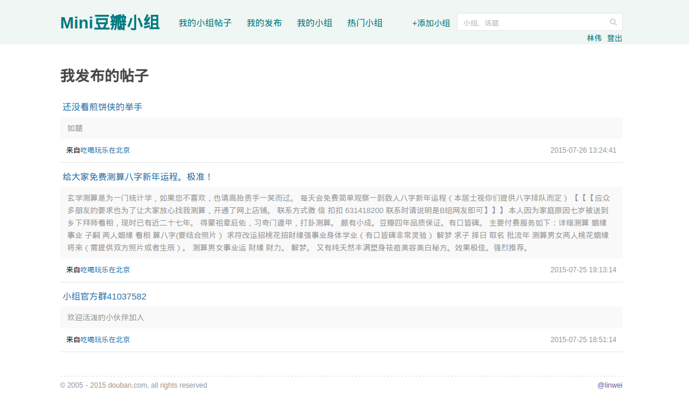

# Mini豆瓣小组
---

项目地址：[http://code.dapps.douban.com/linwei/mygroup](http://code.dapps.douban.com/linwei/mygroup)
线上演示地址：[http://doubandev2.intra.douban.com:20110/](http://doubandev2.intra.douban.com:20110/)

## 特性
- 基于Flask框架实现的简易版小组
- 支持豆瓣账号登录
- 可以浏览自己发表的帖子
- 支持创建小组，发布帖子
- 忽略Aray新增的需求 （邀请是什么鬼T_T）

## 界面预览
### 我关注的小组帖子

### 我发布的帖子

### 我的小组

### 创建小组

### 小组主页

### 发布帖子

### 发表评论

